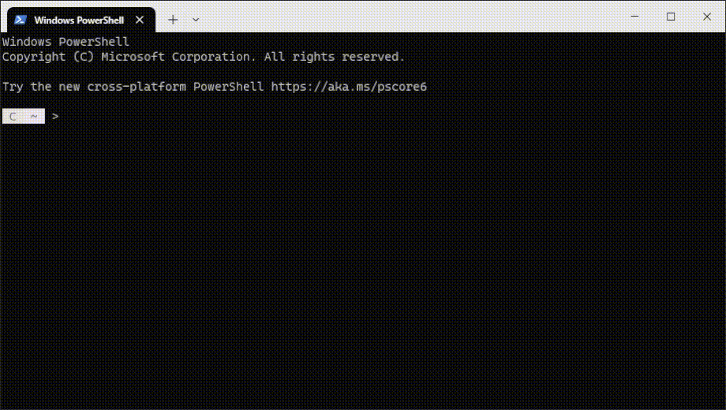

# [Git](https://gitforwindows.org/) + [Moar](https://github.com/walles/moar)

**Git** es quizá el [sistema de control de versiones](https://en.wikipedia.org/wiki/Distributed_version_control) más popular, creado por [Linus Torvalds](https://en.wikipedia.org/wiki/Linus_Torvalds) (Sí, el ingeniero que también desarrolló el kernel de Linux). En palabras más simples, es como una máquina del tiempo para nuestro código o proyectos. Por eso es tan importante.

**Moar** es un [paginador](https://en.wikipedia.org/wiki/Terminal_pager), que sirve para leer textos largos en la terminal de una forma más cómoda (como el de `git log`). ¿Por qué no simplemente usar [less](https://github.com/jftuga/less-Windows)? Bueno... Moar por defecto es más legible, por ejemplo, se le puede pasar el parámetro `--no-clear-on-exit` y no romperá los textos anteriores de la terminal.



Este repositorio contiene un script para administrar estos programas.

# Índice

- Administración
    - [Requisito previo](#requisito-previo)
    - [Instalación](#instalación)
    - [Actualización](#actualización)
    - [Eliminación](#eliminación)
- Uso
    - Configuración
    - GitHub SSH

# Requisito previo

Si se va a ejecutar el script, antes de eso, la [directiva de ejecución](https://learn.microsoft.com/en-us/powershell/module/microsoft.powershell.core/about/about_execution_policies?view=powershell-5.1) debe estar puesta en `RemoteSigned` o `Unrestricted`.

Se puede revisar cuál es la directiva de ejecución actual con:

```powershell
Get-ExecutionPolicy
```

El comando a continuación cambia la directiva de ejecución a *RemoteSigned* en el usuario actual.

```powershell
Set-ExecutionPolicy -ExecutionPolicy RemoteSigned -Scope CurrentUser
```

Se puede usar el scope `Process` si se quiere hacer el cambio sólo en la sesión actual de PowerShell, la directiva de ejecución se eliminaría cuando se cierre la shell.

# Instalación

### Script

La forma más rápida de instalar ambos programas es con el siguiente comando.

```powershell
irm -Uri "https://raw.githubusercontent.com/ettodrzz/Cara/main/Windows/Git/git.ps1" -OutFile "$Env:Temp\git.ps1"; .$Env:Temp\git.ps1
```

Guardará los archivos ejecutables en `%LocalAppData$\Programs` y le creará sus rutas en la [variable de entorno](https://en.wikipedia.org/wiki/Environment_variable#Assignment:_DOS,_OS/2_and_Windows) Path del usuario actual.

# Actualización

### Script

Si anteriormente se instalaron ambos programas de forma correcta con el mismo script, al ejecutarlo otra vez, descargará nuevas versiones de Git y Moar.

```powershell
irm -Uri "https://raw.githubusercontent.com/ettodrzz/Cara/main/Windows/Git/git.ps1" -OutFile "$Env:Temp\git.ps1"; .$Env:Temp\git.ps1
```

# Eliminación

### Script

Si anteriormente se instalaron ambos programas de forma correcta con el mismo script. También se puede usar para eliminar estos programas, tan sólo es agregarle el parámetro `-Remove` o `-R`.

```powershell
irm -Uri "https://raw.githubusercontent.com/ettodrzz/Cara/main/Windows/Git/git.ps1" -OutFile "$Env:Temp\git.ps1"; .$Env:Temp\git.ps1 -Remove
```

Eliminará los archivos ejecutables que están en `%LocalAppData$\Programs` y las rutas que están en la [variable de entorno](https://en.wikipedia.org/wiki/Environment_variable#Assignment:_DOS,_OS/2_and_Windows) Path del usuario actual.