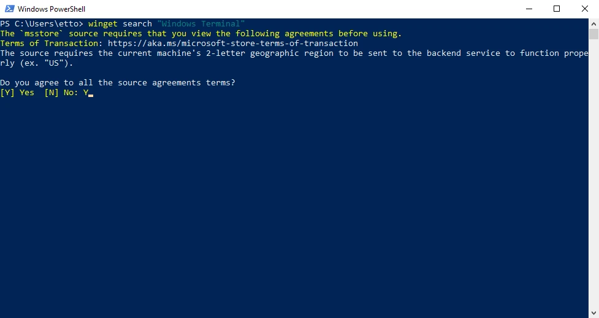

# [Winget](https://learn.microsoft.com/en-us/windows/package-manager)

Es el [administrador de paquetes](https://en.wikipedia.org/wiki/Package_manager) de Windows. Su función es instalar, configurar o desinstalar programas desde la terminal.

Es muy útil para ahorrar tiempo, desde una [interfaz de línea de comandos](https://en.wikipedia.org/wiki/Command-line_interface) se pueden gestionar aplicaciones sin necesidad de estar navegando entre interfaces gráficas o páginas web.

# Instalación

Por defecto, winget ya viene pre-instalado en versiones recientes de Windows 10 (sólo funciona después de la [build 1709](https://en.wikipedia.org/wiki/Windows_10,_version_1709)).

```powershell
# Comprueba la versión instalada
winget --version
```

Por si alguna razón, al intentar revisar la versión retorna un error, quizá es porque winget aún no está instalado. Este problema es común en usuarios recién creados.

```powershell
# Fuerza la instalación
Add-AppxPackage -RegisterByFamilyName -MainPackage Microsoft.DesktopAppInstaller_8wekyb3d8bbwe
```

# Uso

Para empezar a usar winget, antes se tienen que aceptar algunos [términos de la Microsoft Store](https://aka.ms/microsoft-store-terms-of-transaction). Tan simple como escribir la letra `Y` para aceptar estos términos.



La sintaxis es sencilla, a continuación se muestran algunos ejemplos de como usarlo:

```powershell
# Busca si una aplicación está disponible
winget search "app example"

# Instala una aplicación
winget install id.example

# Lista todas las aplicaciones instaladas
winget list
# Busca una aplicación instalada por su nombre
winget list --name "app example"

# Desinstala una aplicación
winget uninstall id.example
```

[`↗` Más comandos e información](https://learn.microsoft.com/en-us/windows/package-manager/winget/#commands)

----

[`↑` Regresar al inicio](#winget)